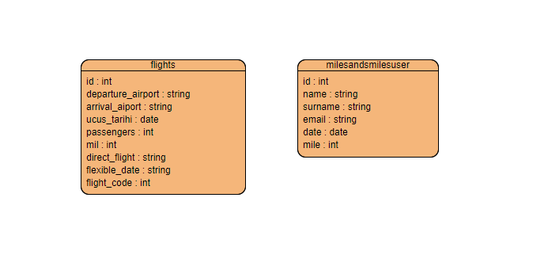

# Airline Ticketing System

## Overview
Airline Ticketing System is a web application built with Flask to manage ticketing activites. It includes features for paying with Miles&Smiles points, creating a flight, creating a new Miles&Smiles user.

## Feature
- Add Flights
- Search Flights
- Buy Ticket
- Create New Admin User
- Create Miles&Smiles User
- SMTP Mail Sender
- Daily Scheduler

## Assumptions
- Assuming when a user buys a ticket, there is no need to send it to queue. Backend service can handle the miles point's transactions. If flight is cancelled, then another action can be taken.
- Assuming when a user buys a ticket, if she/he doesn't pay with Miles&Smiles points, system gives flight_mile/3 points to the user.
- Assuming each flight has unique flight_code.

## Deployment
- **Storage:** Azure Database for PostgreSQL flexible server
- **Frontend:** Azure App Service
- **Backend:** Azure App Service
- **Gateway:** Azure API Management
- **Queue:** Azure Message Queue
- **Scheduler:** Azure App Service + Google Scheduler

## Encountered Issues

1. Gateway Integration
    Resolution: [Microsoft Azure API Management](https://learn.microsoft.com/en-us/azure/api-management/api-management-key-concepts)

## Deployment Urls

1. **UI Layer Deployed at:**
   `https://finalfrontendbrk.azurewebsites.net/v1`
2. **Ticketing System Deployed at:**
   `https://backend4458.azurewebsites.net/v1`
3. **Scheduler Service Deployed at:**
   `https://dailyworkerfinal.azurewebsites.net`
## Data Models

## Presentation Link
